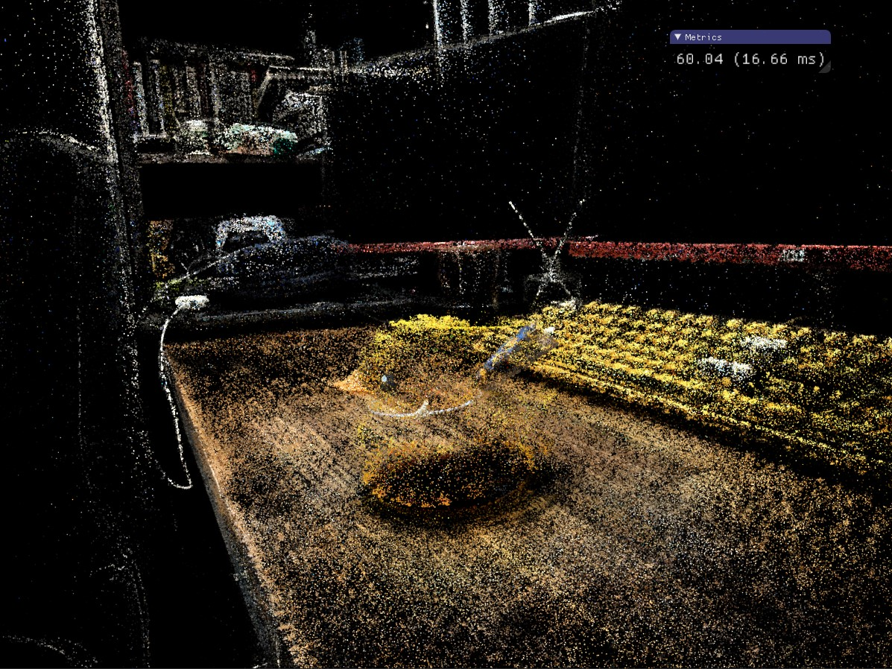
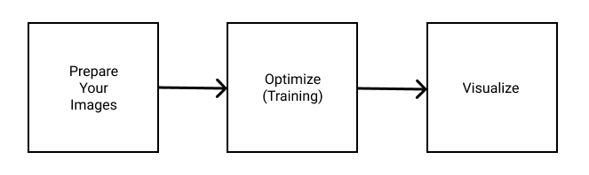
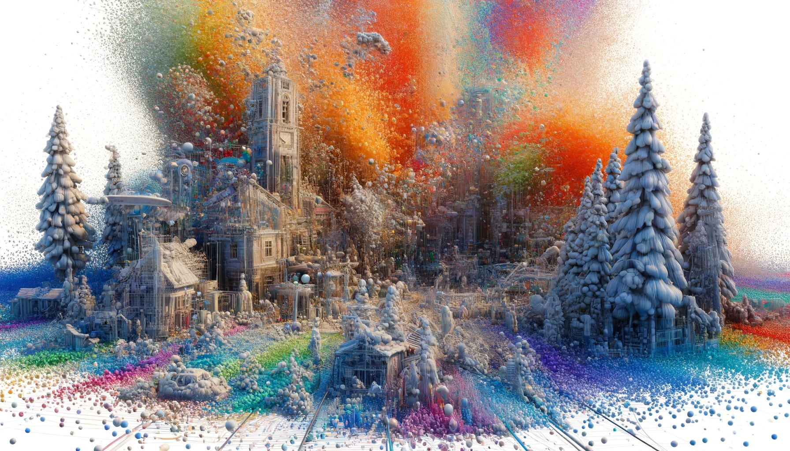

# 3D-Gaussian-Splatting
This repository is only a record of my experience in generating a 3D scene from scratch. Please search for the official author's repository for more information.

## 3D Scene Reconstruction of Yellow Duck

## Requirements
I think the most important requirement is that the GPU needs to have 24 GB of VRAM (to train models to the quality level described in the paper). For other requirements, such as environment setup, you could search the following resources for help:
+ Original repo of Gaussian Splatting: https://github.com/graphdeco-inria/gaussian-splatting/tree/main
+ Great step-by-step Tutorial: https://www.youtube.com/watch?v=UXtuigy_wYc

## Step

1. Prepare images (either your own or downloaded from the website)
   * Use COLMAP to convert raw images into point cloud: `python convert.py -s <location>`
   * FFmpeg is the right tool for splitting your video into individual images: `ffmpeg -i {video} -qscale:v 1 -qmin 1 -vf fps={fps} %d.jpg`
2. Optimize/Training 3D Gaussians: `python train.py -s <path to COLMAP or NeRF Synthetic dataset>`
3. Visualize the 3D scene reconstruction result of Gaussian Splatting using the SIBR viewer: `./<SIBR install dir>/bin/SIBR_gaussianViewer_app -m <path to trained model>`

+ Note: The previous image was borrowed from https://github.com/jonstephens85/gaussian-splatting-Windows?tab=readme-ov-file
+ Note: If something happens when compiling `diff-gaussian-rasterization` or `simple-knn`, and the error message is related to `cl.exe`, make sure you add the path like `C:\Program Files\Microsoft Visual Studio\2022\Community\VC\Tools\MSVC\14.33.31629\bin\Hostx64\x64` to your environment variables.

## By the Way... Generate Image from DALL·E
+ The Prompt I gave for DALL·E "Gaussian Splatting uses millions of 3D Gaussians for explicit scene representation, and it's capable of real-time rendering"

